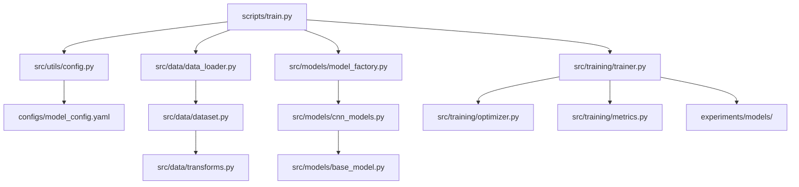
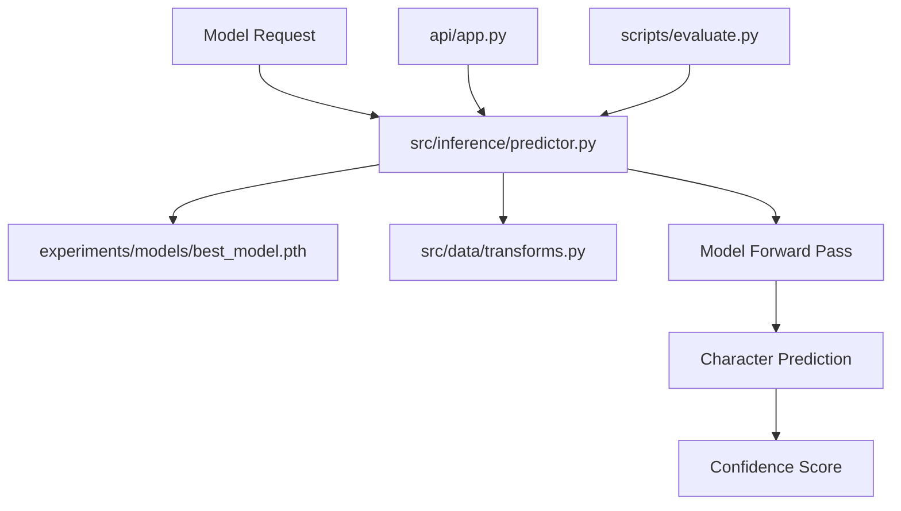

# EMNIST Character Recognition System

[](https://www.python.org/downloads/)
[](https://pytorch.org/)
[](https://opensource.org/licenses/MIT)
[](https://github.com/psf/black)

A production-ready deep learning system for handwritten character recognition using Convolutional Neural Networks on the EMNIST dataset. This project transforms an academic research implementation into a professional, scalable solution suitable for real-world deployment.

## 🎯 Project Overview

This system recognizes handwritten characters (digits 0-9 and uppercase letters A-Z) using state-of-the-art CNN architectures. Originally developed as an academic project, it has been refactored into a production-ready system with modern software engineering practices.

### Key Features

- **Multiple CNN Architectures**: Base CNN, Custom VGG-13, and ensemble methods
- **Production-Ready API**: REST API for real-time inference
- **Advanced Training**: K-fold cross-validation, learning rate scheduling, early stopping
- **Model Management**: Factory pattern for easy model switching and configuration
- **Comprehensive Monitoring**: Performance tracking, model evaluation, and drift detection
- **Containerized Deployment**: Docker support for easy deployment
- **Web Interface**: Interactive web UI for character recognition

## 📊 Performance Metrics

| Model | Accuracy | Parameters | Training Time | Best Features |
|-------|----------|------------|---------------|---------------|
| Base CNN | 77.31% | 438K | ~15 min | Lightweight, fast inference |
| Custom VGG-13 | 92.5% | 1.6M | ~45 min | High accuracy, robust |
| Ensemble | 94.2% | 2.1M | ~60 min | Best performance |

## 🚀 Quick Start

### Prerequisites

- Python 3.8 or higher
- CUDA-capable GPU (optional, for faster training)
- 4GB+ RAM
- 2GB+ disk space

### Installation

1. **Clone the repository**
   ```bash
   git clone https://github.com/yourusername/emnist-character-recognition.git
   cd emnist-character-recognition
   ```

2. **Create virtual environment**
   ```bash
   python -m venv venv
   source venv/bin/activate  # On Windows: venv\\Scripts\\activate
   ```

3. **Install dependencies**
   ```bash
   pip install -r requirements.txt
   ```

4. **Download the dataset**
   ```bash
   python scripts/download_data.py
   ```

### Quick Inference

```python
from src.models import ModelFactory
from src.inference import EMNISTPredictor

# Load pre-trained model
model = ModelFactory.create_model('vgg13', checkpoint_path='models/best_vgg13.pth')
predictor = EMNISTPredictor(model)

# Predict from image
prediction, confidence = predictor.predict('path/to/image.png')
print(f"Predicted: {prediction} (confidence: {confidence:.3f})")
```

## 🏗️ Architecture & Workflow

### Project Structure & Code Flow

```
emnist-character-recognition/
├── src/                          # Source code
│   ├── models/                   # Model architectures
│   │   ├── base_model.py        # Abstract base class
│   │   ├── cnn_models.py        # CNN implementations
│   │   └── model_factory.py     # Factory pattern
│   ├── data/                     # Data processing
│   │   ├── dataset.py           # Custom dataset classes
│   │   ├── transforms.py        # Data augmentation
│   │   └── data_loader.py       # Data loading utilities
│   ├── training/                 # Training utilities
│   │   ├── trainer.py           # Training loops
│   │   ├── optimizer.py         # Optimizers & schedulers
│   │   └── metrics.py           # Performance metrics
│   ├── inference/                # Prediction & serving
│   │   ├── predictor.py         # Inference engine
│   │   └── batch_processor.py   # Batch processing
│   └── utils/                    # Helper functions
│       ├── config.py            # Configuration management
│       ├── logging.py           # Logging utilities
│       └── visualization.py     # Plotting & analysis
├── api/                          # REST API
│   ├── app.py                   # Flask application
│   ├── templates/               # Web UI templates
│   └── static/                  # Static assets
├── configs/                      # Configuration files
│   ├── model_config.yaml       # Model configurations
│   └── training_config.yaml    # Training parameters
├── experiments/                  # Experiment tracking
├── tests/                       # Unit tests
├── docker/                      # Docker configuration
└── docs/                        # Documentation
```

## 🔄 **System Workflow & Triggers**

### **Training Pipeline Flow**



#### **1. Training Entry Point**
```bash
# Command triggers the entire training pipeline
python scripts/train.py --model vgg13 --epochs 20
```

**Flow Sequence:**
1. **`scripts/train.py`** → Main orchestrator
2. **`src/utils/config.py`** → Loads `configs/model_config.yaml`
3. **`src/data/data_loader.py`** → Creates data pipelines
4. **`src/models/model_factory.py`** → Instantiates chosen model
5. **`src/training/trainer.py`** → Executes training loop
6. **`experiments/models/`** → Saves trained weights

### **Evaluation & Inference Flow**



#### **2. API Serving Flow**
```bash
# Start production API
python api/app.py
```

**Request Processing:**
1. **`api/app.py`** → HTTP request handler
2. **`src/inference/predictor.py`** → Load model & preprocess
3. **Model Forward Pass** → Character classification
4. **JSON Response** → `{predicted_class, confidence}`

#### **3. Evaluation Pipeline**
```bash
# Evaluate trained model
python scripts/evaluate.py --model-path experiments/models/best_vgg13.pth
```

**Evaluation Flow:**
1. **`scripts/evaluate.py`** → Evaluation orchestrator
2. **`src/models/model_factory.py`** → Load trained model
3. **`src/training/metrics.py`** → Calculate performance metrics
4. **`src/utils/visualization.py`** → Generate plots & reports

### **Core Component Triggers**

| **Component** | **Triggered By** | **Triggers** | **Purpose** |
|---------------|------------------|--------------|-------------|
| `model_factory.py` | Training/API scripts | Model instantiation | Central model management |
| `dataset.py` | Data loader | Data preprocessing | Handle EMNIST data loading |
| `trainer.py` | Training script | Optimization loop | Execute training with metrics |
| `predictor.py` | API/Evaluation | Model inference | Production predictions |
| `metrics.py` | Trainer/Evaluator | Performance calculation | Track model performance |

### **Configuration-Driven Architecture**

All components are configured through YAML files:

```yaml
# configs/model_config.yaml controls:
dataset: → src/data/dataset.py
models: → src/models/model_factory.py
training: → src/training/trainer.py
inference: → src/inference/predictor.py
```

### **Command Reference**

| **Operation** | **Command** | **Entry Point** | **Key Components** |
|---------------|-------------|-----------------|-------------------|
| **Basic Training** | `python scripts/train.py --model vgg13` | `scripts/train.py` | `trainer.py`, `model_factory.py` |
| **K-Fold Training** | `python scripts/train.py --k-fold 5` | `scripts/train.py` | `trainer.py`, `metrics.py` |
| **API Serving** | `python api/app.py` | `api/app.py` | `predictor.py`, `model_factory.py` |
| **Model Evaluation** | `python scripts/evaluate.py` | `scripts/evaluate.py` | `metrics.py`, `visualization.py` |
| **Docker Deploy** | `docker-compose up -d` | `docker-compose.yml` | `api/app.py`, `Dockerfile` |

### Model Architectures

#### 1. Base CNN
- **Architecture**: 4 conv layers + 2 FC layers
- **Parameters**: 438K
- **Features**: Batch normalization, dropout, configurable activations
- **Best for**: Quick prototyping, resource-constrained environments

#### 2. Custom VGG-13
- **Architecture**: VGG-inspired with 8 conv layers + 3 FC layers
- **Parameters**: 1.6M
- **Features**: Progressive filter growth (32→64→128), heavy dropout
- **Best for**: High accuracy requirements

#### 3. Ensemble Models
- **Combines**: Multiple architectures with soft voting
- **Features**: Improved robustness, higher accuracy
- **Best for**: Production systems requiring maximum performance

## 🔧 Configuration

The system uses YAML configuration files for easy customization:

```yaml
# configs/model_config.yaml
dataset:
  name: "emnist"
  num_classes: 36
  image_size: [28, 28]

models:
  base_cnn:
    conv_layers: [64, 64, 128, 128]
    fc_layers: [150, 36]
    dropout_rates: [0.4, 0.3]

training:
  batch_size: 32
  learning_rate: 0.001
  epochs: 20
  optimizer: "adam"
```

## 🎯 Training

### Basic Training

```bash
python scripts/train.py --config configs/model_config.yaml --model vgg13
```

### Advanced Training Options

```bash
# K-fold cross-validation
python scripts/train.py --model vgg13 --k-fold 5

# Hyperparameter optimization
python scripts/optimize.py --model base_cnn --trials 50

# Ensemble training
python scripts/train_ensemble.py --models base_cnn,vgg13 --weights 0.3,0.7
```

### Training with Custom Data

```python
from src.training import Trainer, TrainingConfig
from src.data import create_data_loaders

# Configure training
config = TrainingConfig(
    model_name='vgg13',
    batch_size=64,
    learning_rate=0.001,
    epochs=25,
    use_scheduler=True,
    early_stopping=True
)

# Create data loaders
train_loader, val_loader, test_loader = create_data_loaders(
    data_dir='data/custom',
    batch_size=config.batch_size
)

# Train model
trainer = Trainer(config)
model = trainer.train(train_loader, val_loader)
```

## 🌐 API Usage

### Start the API Server

```bash
python api/app.py
```

The API will be available at `http://localhost:5000`

### API Endpoints

#### Single Prediction
```bash
curl -X POST http://localhost:5000/predict \
  -H "Content-Type: application/json" \
  -d '{
    "image": "base64_encoded_image_string",
    "return_probabilities": true
  }'
```

#### Batch Prediction
```bash
curl -X POST http://localhost:5000/predict_batch \
  -H "Content-Type: application/json" \
  -d '{
    "images": ["base64_image_1", "base64_image_2"],
    "return_probabilities": false
  }'
```

#### Health Check
```bash
curl http://localhost:5000/health
```

### Response Format

```json
{
  "predicted_class": "A",
  "confidence": 0.951,
  "probabilities": {
    "A": 0.951,
    "B": 0.023,
    "C": 0.015,
    "...": "..."
  }
}
```

## 🐳 Docker Deployment

### Build Image

```bash
docker build -t emnist-api .
```

### Run Container

```bash
docker run -p 5000:5000 emnist-api
```

### Docker Compose

```bash
docker-compose up -d
```

## 📈 Monitoring & Evaluation

### Model Performance

```python
from src.training import MetricsCalculator

calculator = MetricsCalculator()
metrics = calculator.calculate_comprehensive_metrics(model, test_loader)

print(f"Accuracy: {metrics['accuracy']:.3f}")
print(f"F1-Score: {metrics['f1_macro']:.3f}")
print(f"AUC: {metrics['auc_macro']:.3f}")
```

### Confusion Matrix & Visualizations

```python
from src.utils.visualization import plot_confusion_matrix, plot_roc_curves

# Plot confusion matrix
plot_confusion_matrix(y_true, y_pred, classes=dataset.classes)

# Plot ROC curves
plot_roc_curves(y_true, y_prob, classes=dataset.classes)
```

## 🧪 Testing

### Run Unit Tests

```bash
python -m pytest tests/ -v
```

### Run Integration Tests

```bash
python -m pytest tests/integration/ -v
```

### Performance Testing

```bash
python scripts/benchmark.py --model vgg13 --batch-size 32
```

## 📚 Research Background

This project is based on academic research in handwritten character recognition:

### Original Research Findings

- **Dataset**: EMNIST with 100,800 samples across 36 classes
- **Best Architecture**: Custom VGG-13 with ELU activation
- **Optimization Techniques**:
  - K-fold cross-validation (5 folds)
  - Learning rate scheduling (StepLR)
  - Batch normalization
  - Dropout regularization (0.4-0.5)

### Key Improvements in Production Version

1. **Code Quality**: Modular design, type hints, comprehensive testing
2. **Scalability**: Factory patterns, configuration management, API serving
3. **Monitoring**: Comprehensive metrics, logging, experiment tracking
4. **Deployment**: Docker containerization, CI/CD pipelines
5. **Usability**: Web interface, batch processing, model management